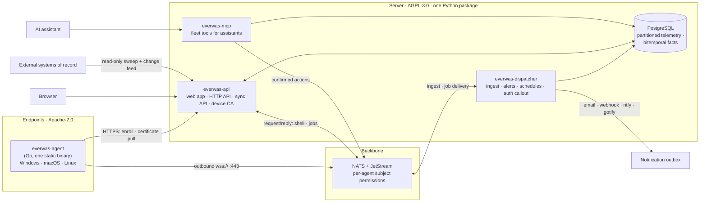
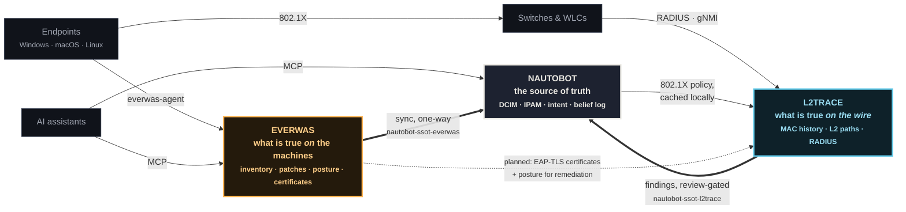

## The agent

A single static Go binary per endpoint, built with `CGO_ENABLED=0`, so
there is nothing to install alongside it. It runs as a system service
(systemd, launchd, or the Windows SCM), collects telemetry and
inventory, executes jobs, and hosts the PTY behind the browser terminal.

It connects **outbound only**, `wss://` on port 443 by default, which
traverses NAT and corporate egress policies without firewall rules on
the endpoint side. The transport choice is recorded in
[ADR-0001](/decisions/0001-nats-transport/).

Updates are self-applied: the server offers a signed build (sha256 plus a
minisign signature), the agent verifies, swaps itself, and rolls back
automatically if the new binary fails to come up.

## The backbone

NATS with JetStream sits between agents and the server, doing three jobs
that would otherwise each need their own infrastructure:

- **Request/reply** maps onto "send this command to agent X and await a
  response" with no hand-rolled correlation layer.
- **Per-subject authorization** gives each agent a namespace of its own;
  the [security model](/concepts/security-model/) covers how.
- **JetStream** provides durable job delivery to offline agents and
  ingest buffering, without adding Redis or a task queue.

The full subject namespace is in the
[wire protocol reference](/reference/wire-protocol/).

## The server

Two processes from one Python package:

- **`everwas-api`**: the FastAPI application serving the web app and the
  HTTP API from a single origin. Enrollment also lands here, over HTTPS.
- **`everwas-dispatcher`**: an asyncio process consuming the JetStream
  ingest streams, evaluating alert rules, reconciling schedules, and
  answering NATS auth-callout requests.

State lives in PostgreSQL. Telemetry goes into daily range-partitioned
tables (plain PostgreSQL, deliberately not TimescaleDB; see
[ADR-0002](/decisions/0002-postgres-partitioning/)), and inventory facts
are stored [bitemporally](/concepts/bitemporal/).

## The front door

Every HTTP surface (web app, API, the NATS websocket listener, the
optional MCP server) is published through caddy-docker-proxy labels, so
one Caddy instance owns TLS for all of it. The NATS listener gets a
hostname of its own for a concrete reason: the Go NATS client ignores
the path portion of a websocket URL, so it cannot live at a path on the
main domain.

## The bigger picture

Everwas is one member of a family of systems that meet in Nautobot, the
source of truth. Solid lines exist today; dashed lines are designed
(ADR-0003/0004) but not yet wired.

The boxes that did not make the diagram still exist: the Everwas sync
writes through `nautobot-app-rmm-models` (a vendor-neutral schema with a
bitemporal belief log, shared with its structural twin
`nautobot-ssot-ninjaone`), and `nautobot-app-scanner` feeds nmap
discovery into the same core, review-gated like everything else.

Three properties of this constellation are deliberate:

- **Nautobot is where the systems meet.** Everwas and l2trace do not
  talk to each other directly. Everwas reports what is true *on*
  machines; l2trace observes what is true *between* them; Nautobot
  reconciles both against intent.
- **Bitemporality is the family trait.** Everwas facts, l2trace
  observations, and the rmm-models belief log all carry both time axes,
  so "what did we believe last Tuesday" survives every hop.
- **Discovery never overwrites intent.** The l2trace and scanner apps
  land findings as review-gated proposals. A human applies them; the
  sync from Everwas writes only into its own vendor-neutral models.
