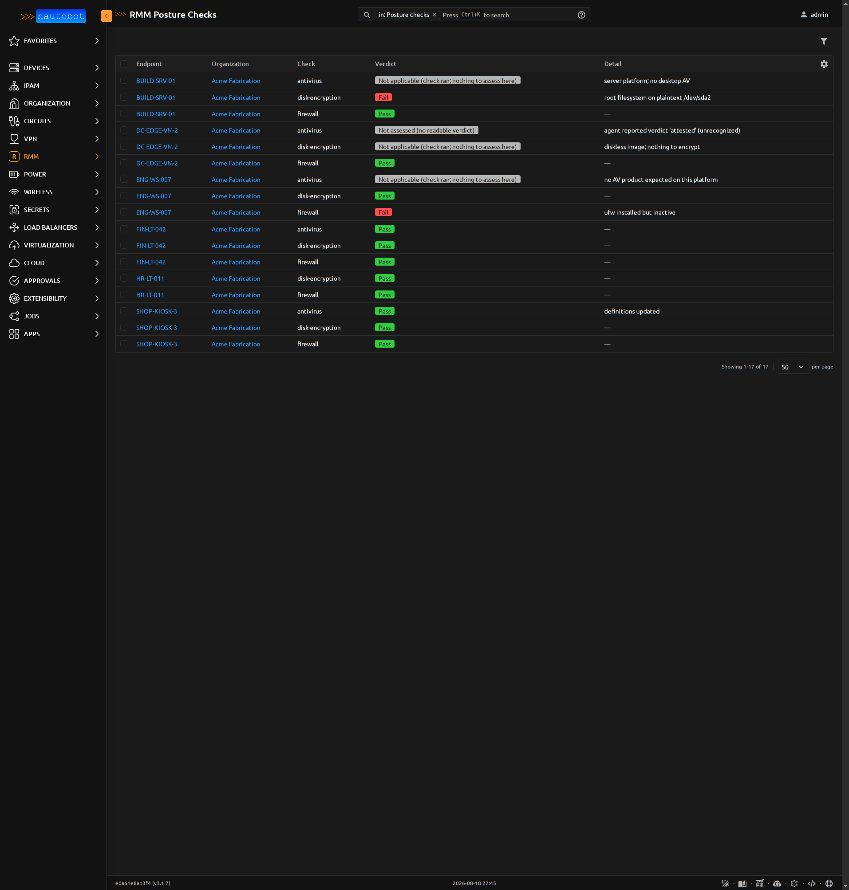
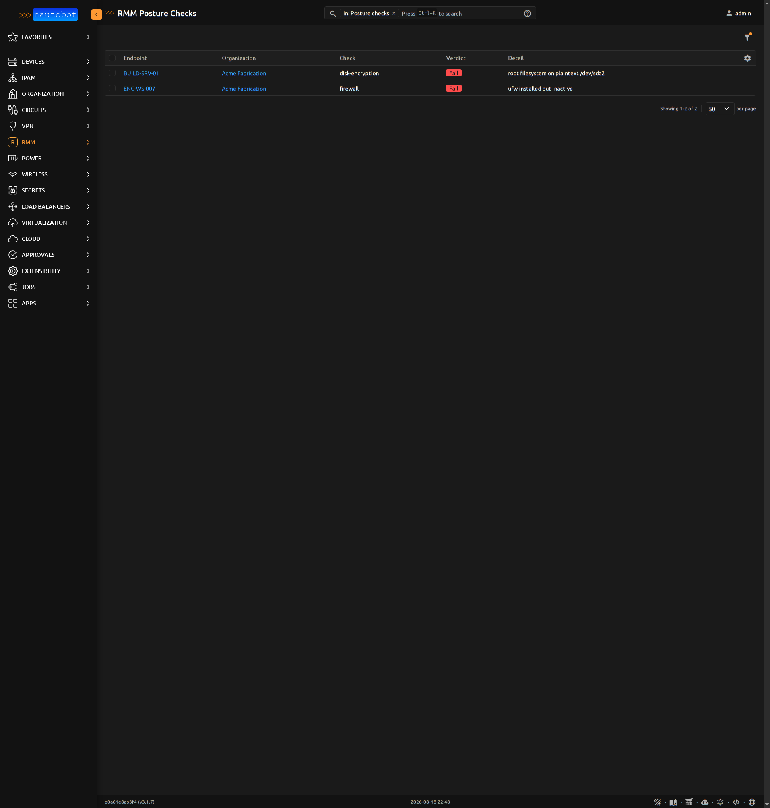
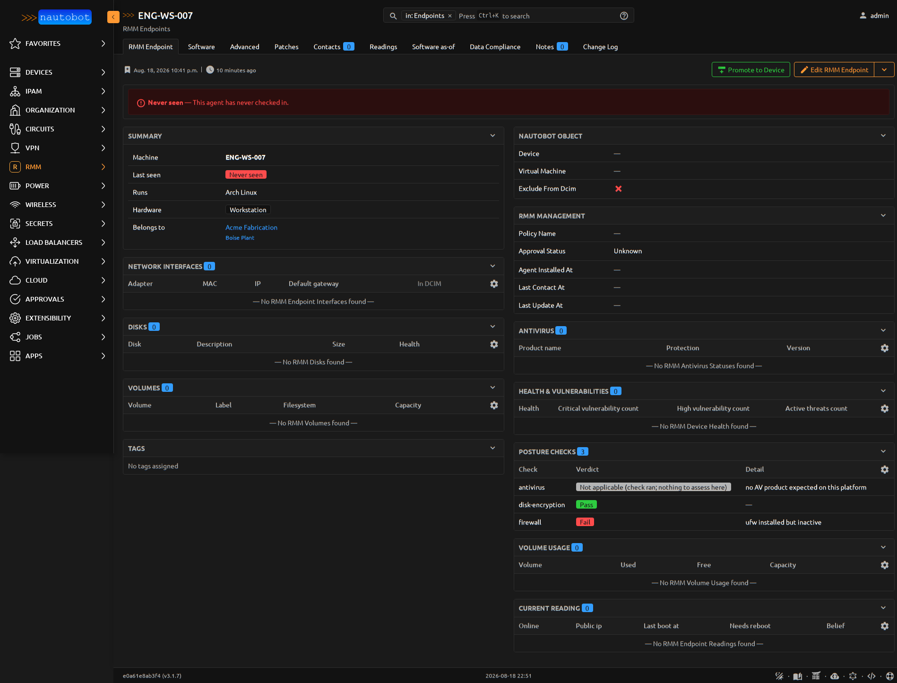

Everwas can feed Nautobot as a system of record: a scheduled SSoT job
sweeps the [sync API](/reference/sync-api/) and lands the fleet in
Nautobot — endpoints and interfaces through the diff, and software,
patch state, and per-check security posture as bitemporal beliefs, so
"what did Nautobot know last Tuesday" stays answerable there too. The
sync is one-way on purpose: Everwas is authoritative for what its own
agents report, and nothing in Nautobot writes back.

This guide assumes a working Everwas server and a Nautobot 3.x
instance you administer.

## Install the Nautobot apps

Two apps, split deliberately: `nautobot-rmm-models` carries the models,
the vendor-neutral diff layer, and the bitemporal recorders, shared with
every other RMM source; `nautobot-ssot-everwas` is the thin adapter that
maps the Everwas sync API onto them.

```bash
pip install nautobot-rmm-models nautobot-ssot-everwas
```

Enable all three in `nautobot_config.py` and run migrations:

```python
PLUGINS = [
    "nautobot_ssot",
    "nautobot_rmm_models",
    "nautobot_ssot_everwas",
]
```

The adapter needs `nautobot-rmm-models` at or past its first release
after 2026-07-22 — that release carries the Everwas vendor choice and
the `RMMPostureCheck` per-check posture model the sync records into.

## Mint a scoped key

In Everwas, mint an API key with the `devices:read` scope, plus
`patches:read` if you sync patch state (admin UI, or
`POST /api/v1/admin/api-keys`). The key looks like
`ewpk_<id>_<secret>` and is shown once.

The job exchanges that key for a short-lived `ewst_` bearer token
(RFC 6749 client credentials against `/api/v1/auth/token`) and
re-exchanges on expiry — you never handle tokens yourself. Revoking the
key invalidates its outstanding tokens immediately, so rotation is
instant: mint the new key, update the secret, revoke the old one.

## Point Nautobot at Everwas

1. Create a Nautobot **SecretsGroup** with an HTTP *password* secret
   holding the whole `ewpk_` key. (The HTTP *username* slot is optional,
   only for OAuth2 tooling that insists on a split client_id/client_secret
   pair; the sync API accepts the whole key as `client_secret` alone.)
2. Create an **RMMSource** with vendor **Everwas**, attach the
   SecretsGroup, and set `base_url` to your Everwas server. The URL is
   required — Everwas is self-hosted and there is no default.

Credentials are never a job field, which is what lets the job be
scheduled. If a SecretsGroup is impractical, `EVERWAS_API_KEY` in the
worker's environment is the fallback.

## Run the job

Run **Everwas → Nautobot** under Jobs. Dry-run first: it prints the
full diff without writing anything. The defaults are safe — the sync is
additive-only unless you switch on *Delete records missing from
Everwas*, and even a delete run refuses to proceed when the source
returns less than half the endpoints already known, because a drop that
steep is a failed fetch, not a fleet shrink.

Toggles worth knowing on the first run:

| Toggle | Default | Notes |
|---|---|---|
| Sync installed software | on | Name+version only; that is all the agent collects today |
| Sync OS patches | on | Needs `patches:read` on the key |
| Sync security posture | on | Per-check verdicts into the posture belief log |
| Record endpoint readings | on | Online/offline from device status, no extra sweep |
| Include retired devices | off | The feed includes them by contract; importing them into an additive-only sync would accumulate decommissioned machines forever |
| Link to Tenants / Locations / Devices | on | DCIM enrichment, gated further per device class (below) |

The job is built for fleets: four paged API sweeps total, zero
per-device calls, and backoff on errors bounded by a wall-clock budget.

## What a sync produces

Organizations become Tenants, sites become Locations, and each device
becomes an `RMMEndpoint` with its interfaces, all reconciled through
the diff. Software installations, patch state, endpoint readings, and
security posture are recorded as beliefs on two axes —
<span class="vt">valid time</span> for when it was true on the machine,
<span class="rt">record time</span> for when the sync learned it — the
same [bitemporal model](/concepts/bitemporal/) Everwas keeps, preserved
across the wire.

Posture is per-check rather than a rollup: one row per
(endpoint, check), so `disk-encryption`, `firewall`, and `antivirus`
each carry their own verdict and history.



:::note[The three-state rule]
Only an explicit `fail` is a failure. A check absent from an endpoint
never ran there, and an unknown status is *not assessed* — never
failed. Not-assessed is the normal, permanent state for most of a
fleet, not a gap to be closed. Anything gating on posture (compliance
reports, network quarantine) must hold this line, because misreading
no-verdict as `fail` cuts healthy machines off.
:::

That rule is why the posture list's `?failing=true` filter is strict —
explicit fails only — and it is the same set behind the failing-checks
tile on the **Fleet Console** (RMM → Console), which is the fastest
route from "did the sync find problems" to the machines that have them.



### Optional: DCIM enrichment

With linking enabled, endpoints whose `vendor_class` (laptop, desktop,
server, ...) appears in the source's `device_creation_node_classes`
allowlist are promoted to `dcim.Device` records — the allowlist is
empty by default, so nothing is created until you say so. Virtual
machines are deliberately never promoted: the agent inside a guest
knows it is virtualized but not what it runs on, so inventing a Device
(or a placeholder Cluster) would manufacture topology your hypervisor
SSoT actually owns — run that first, and this sync links to the
VirtualMachines it created.

Promoted devices get interfaces with MACs, and because Everwas reports
addresses in CIDR form (`192.0.2.10/24`), the enrichment derives real
IPAM: a Prefix per network, an IPAddress per interface address, and a
primary IPv4 on the Device if it has none.

Each endpoint's detail page shows the linked DCIM objects alongside its
current posture, software, and patch panels:



## Verify it worked

Run the job a second time, immediately. The second run should report no
changes: same sweeps, same diff, nothing to create or update. If it
reports differences on back-to-back runs, something is flapping —
usually a volatile field that should not be diffed, which is worth a
bug report.

Then spot-check the three surfaces: the endpoint count under
RMM → Endpoints matches your fleet (minus retired devices), a device
you know well shows its software and patch state, and the Fleet Console
failing-checks tile agrees with the Everwas security view.

## Scheduling

Nautobot's job scheduler runs the sync on whatever cadence suits you;
because credentials live in the SecretsGroup rather than the job form,
a scheduled run needs no stored secrets of its own. Hourly is a
comfortable default — each run is a handful of paged sweeps, not a
per-device crawl, so frequency is cheap.
